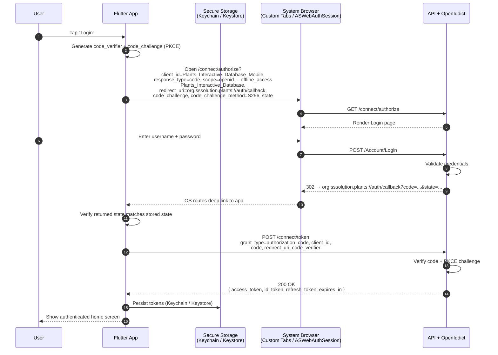
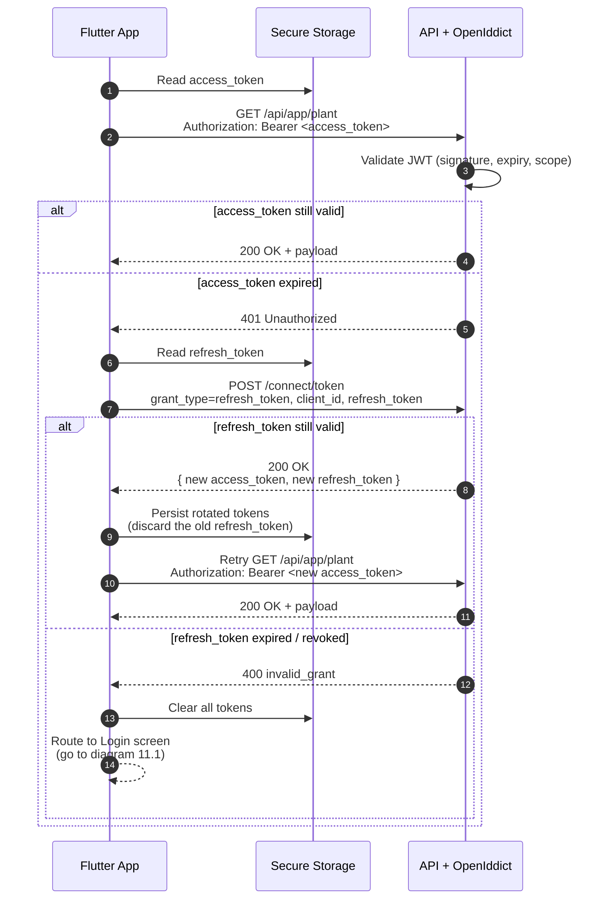
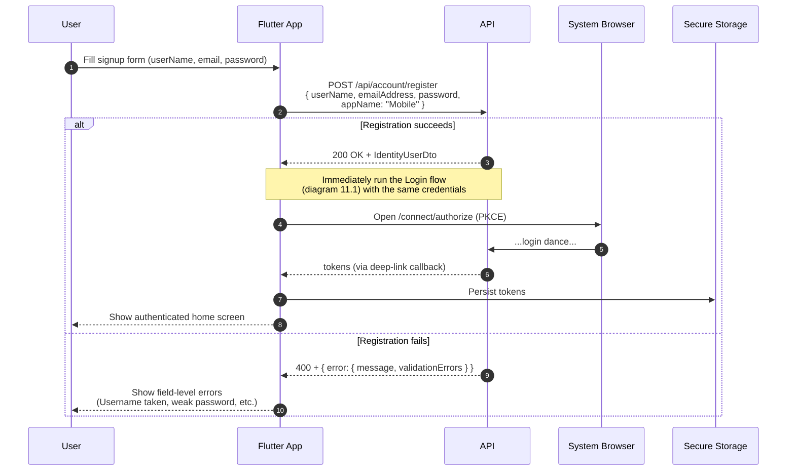
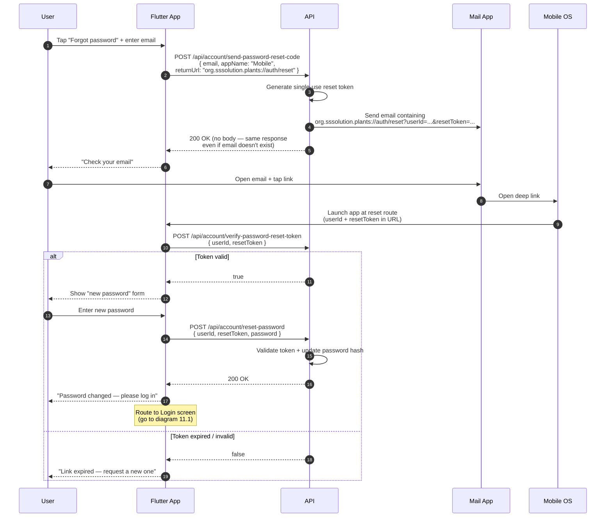
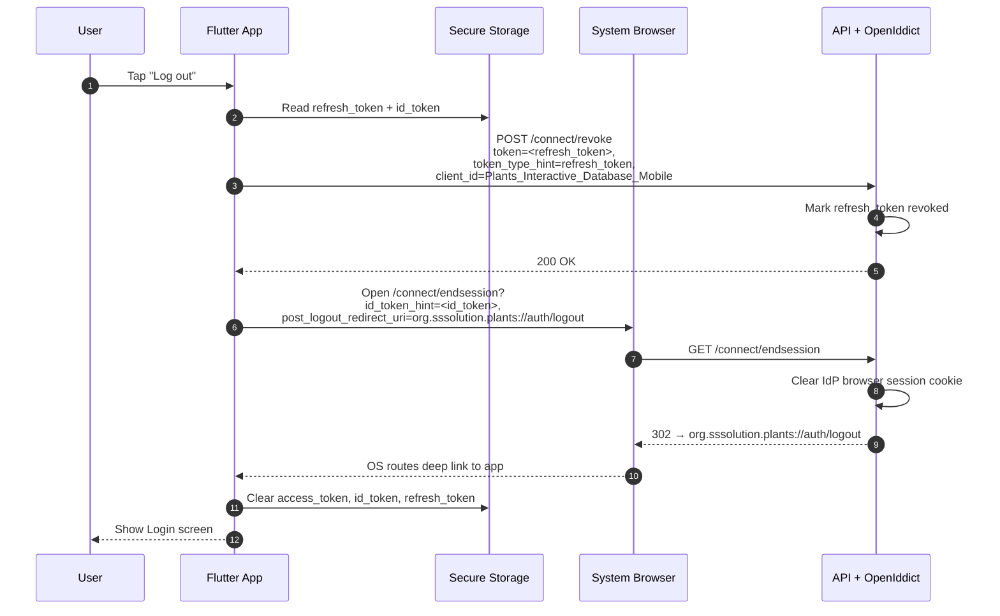

# Authentication and Authorization in Detail

## 1. Overview

This document explains, end-to-end, how authentication (proving who a user is) and authorization (deciding what they can do) work in the Plants Interactive Database backend. The system is built on the **ABP Framework** and uses **OpenID Connect (OIDC)** layered on top of **OAuth 2.0** as the protocol for issuing and validating tokens.

The component that actually implements OIDC/OAuth 2.0 is **OpenIddict**, an OpenID Connect server for ASP.NET Core. OpenIddict acts as the project's **Identity Provider (IdP)** — every login, token issuance, refresh, and revocation goes through it.

If you are integrating a frontend (SPA, mobile app, Swagger, server-to-server caller) with this API, this document tells you exactly which endpoint to call, what parameters to send, and what you'll get back.

---

## 2. Key Concepts (read this first)

Before the flows make sense, you need a working mental model of these terms.

### 2.1. Identity Provider (IdP)

The server that authenticates users and issues tokens. In this project, the IdP is the API itself, running OpenIddict. The IdP exposes a set of well-known HTTP endpoints (see [Section 4](#4-openiddict-endpoints-reference)).

### 2.2. Client

A "client" is **any application that wants to call the API on a user's behalf** — for example, the Angular SPA, the Swagger UI, or a command-line script. Every client is registered with the IdP and gets a unique `client_id`.

Clients come in two types:

- **Public clients** — cannot keep a secret (SPAs, mobile apps). They use PKCE instead of a client secret.
- **Confidential clients** — can keep a secret (a backend service). They authenticate with `client_id` + `client_secret`.

Both clients in this project (`Plants_Interactive_Database_App` and `Plants_Interactive_Database_Swagger`) are **public** — they have no secret. See [OpenIddictDataSeedContributor.cs:98](../Plants_Interactive_Database/Data/OpenIddictDataSeedContributor.cs#L98).

### 2.3. `client_id`

A unique identifier the IdP uses to recognize a client. **It is not a secret** — it is sent in plain HTTP parameters. Its purpose is to tell the IdP which client's configuration (allowed scopes, redirect URIs, grant types) to apply to a request.

In this project the client IDs are:

- `Plants_Interactive_Database_App` — for the frontend application.
- `Plants_Interactive_Database_Swagger` — for the Swagger UI.
- `Plants_Interactive_Database_Mobile` — for the Flutter mobile app (Android & iOS).

#### 2.3.1. `AppName` — not the same as `client_id`

ABP's account endpoints (`POST /api/account/register`, `POST /api/account/send-password-reset-code`, etc.) take a field called **`AppName`** in the JSON body. It is **not the same thing as `client_id`** and the two are easy to confuse.

| | `client_id` | `AppName` |
| --- | --- | --- |
| Identifies | The OAuth/OIDC client (the *caller*) | The application context the user is registering *through* |
| Defined by | OpenIddict — persisted in the DB by the seeder | ABP Account module — just a string in the request body |
| Validated against | A registered client record, allowed redirect URIs, allowed scopes | Nothing — any string is accepted |
| Used at | `/connect/authorize`, `/connect/token`, `/connect/revoke` | `/api/account/register`, `/api/account/send-password-reset-code`, password-reset emails |
| Sent how | Form param / query string in OAuth calls | JSON property in the request body |
| Effect | Authorizes the OAuth flow; determines redirect URIs and scopes | Audit-log label; optional fallback source for email-link URLs |

**What `AppName` actually does:** in practice, **almost nothing for SPA / mobile callers** — it's a string written to the audit log so you can tell which app initiated a registration or password-reset. It does **not** authorize anything, does **not** affect token issuance, and does **not** restrict what the user can do.

It has one secondary role: when ABP sends an account email (password reset, email confirmation, link-login bounce) and the caller did **not** supply a `returnUrl`, ABP falls back to `IAppUrlProvider.GetUrlAsync(appName, …)`, which reads `AppUrlOptions.Applications[appName].RootUrl + Urls[…]`. If the caller supplies `returnUrl` (and its origin is allowlisted in `App:RedirectAllowedUrls`), `AppUrlOptions` is **not consulted** — the email link is built from `returnUrl` directly.

**Practical contract for this project:**

- This project only configures `Applications["MVC"]` ([Plants_Interactive_DatabaseModule.cs:292-298](../Plants_Interactive_Database/Plants_Interactive_DatabaseModule.cs#L292-L298)), so the fallback path only works for `"MVC"`.
- SPA and mobile callers should **always pass `returnUrl`** on `/send-password-reset-code` and any other endpoint that emails a link. Their `returnUrl` origin must be in `App:RedirectAllowedUrls` (configured via the `App__RedirectAllowedUrls` env var, not in the checked-in `appsettings.json`).
- With `returnUrl` supplied, `AppName` is purely an audit label — pick any string and stay consistent for log filtering.

**Conventional values** (you can pick any string, but be consistent because email templating keys off this exact value):

- `"MVC"` — server-rendered Razor Pages. This is what's hardcoded at [RegisterModel.cs:110](../Plants_Interactive_Database/Pages/Account/RegisterModel.cs#L110).
- `"Angular"` — Angular SPA.
- `"React"` / `"Blazor"` / `"MAUI"` — other frontends.
- `"Mobile"` or `"Flutter"` — recommended for the Flutter mobile app.

**Recommended mapping for this project:**

| Caller | `client_id` (OAuth) | `AppName` (account JSON) |
| --- | --- | --- |
| Angular SPA | `Plants_Interactive_Database_App` | `"Angular"` |
| Swagger UI | `Plants_Interactive_Database_Swagger` | n/a (Swagger does not register users) |
| Flutter mobile | `Plants_Interactive_Database_Mobile` | `"Mobile"` |
| Server-rendered pages | (cookie auth, no `client_id`) | `"MVC"` |

> 💡 **`RedirectAllowedUrls` lives in env config, not in `appsettings.json`.** The checked-in [appsettings.json:5](../Plants_Interactive_Database/appsettings.json#L5) shows an empty default — but at runtime [Plants_Interactive_DatabaseModule.cs:297](../Plants_Interactive_Database/Plants_Interactive_DatabaseModule.cs#L297) reads `App:RedirectAllowedUrls` from any configuration source, and the deployed value comes from the `App__RedirectAllowedUrls` env var (typically set in `.env`). If your SPA / mobile `returnUrl` origins aren't in that list, ABP will refuse to use the `returnUrl` and the email link will fall back to the `AppUrlOptions` template lookup (which for non-MVC apps currently goes nowhere useful).

### 2.4. Scope

A scope is a **named permission a client requests** during login. The IdP only issues a token containing the scopes the client asked for AND is allowed to ask for. Scopes appear inside the access token, and APIs read them to decide whether to honor a request.

Two kinds of scopes are used here:

1. **Standard OIDC scopes** (built into the protocol):
   - `openid` — required for any OIDC flow; tells the IdP to issue an `id_token`.
   - `profile` — request the user's name, username, etc.
   - `email` — request the user's email and `email_verified` claims.
   - `phone` — request phone number claims.
   - `address` — request address claims.
   - `roles` — include the user's roles as claims.
   - `offline_access` — request a **refresh token** so the client can stay logged in.

2. **Custom API scope** defined by this project:
   - `Plants_Interactive_Database` — grants access to the project's API resources. **Required** for any call to the API. Defined in [OpenIddictDataSeedContributor.cs:48-59](../Plants_Interactive_Database/Data/OpenIddictDataSeedContributor.cs#L48-L59).

A typical login from the SPA requests all of them:

```text
openid profile email roles offline_access Plants_Interactive_Database
```

### 2.5. Grant Type

A "grant type" is a procedure the client uses to obtain tokens. OpenIddict supports several; this project enables four on the main client:

| Grant Type | What it does | When to use |
| --- | --- | --- |
| `authorization_code` | Browser redirect → user logs in on IdP → IdP returns a code → client exchanges code for tokens. | **Recommended** for SPAs, with PKCE. |
| `password` | Client sends username/password directly to the token endpoint. | Trusted first-party apps, scripts, dev/test only. |
| `client_credentials` | Client authenticates as itself (no user). No `id_token`, just an `access_token`. | Server-to-server jobs that don't act on a user's behalf. |
| `refresh_token` | Client trades a refresh token for a fresh access token. | Always — to avoid making the user log in every hour. |

### 2.6. PKCE (Proof Key for Code Exchange)

PKCE is a security extension to the Authorization Code flow that **replaces the need for a client secret**. It works like this:

1. Before redirecting the user, the client generates a random string called the **`code_verifier`** (43–128 URL-safe characters).
2. The client hashes it: **`code_challenge = BASE64URL(SHA256(code_verifier))`**.
3. The `code_challenge` is sent on the initial `/connect/authorize` request.
4. Later, when the client exchanges the authorization code for tokens, it sends the original `code_verifier`.
5. The IdP recomputes the SHA-256 and confirms it matches the challenge.

This proves that the same client that started the flow is the one finishing it — even though the authorization code travels through the user's browser where it could be intercepted.

### 2.7. Tokens

The IdP can return three different tokens. Know what each is for:

- **`access_token`** — a JWT you attach to every API call (`Authorization: Bearer <token>`). Short-lived (typically 1 hour). Contains scopes, user ID, roles.
- **`id_token`** — a JWT that proves to the **client** who the user is (their `sub`, name, email). It is for the client to read; do NOT send it to the API. Issued only when `openid` is in scopes.
- **`refresh_token`** — a long-lived opaque token used only at `/connect/token` to mint a new `access_token` when the old one expires. Issued only when `offline_access` is in scopes.

### 2.8. Redirect URI

Where the IdP sends the user (in the browser) after they authenticate. **The redirect URI used in a request must exactly match one that was pre-registered for the client.** This is what stops an attacker from sending the auth code to their own server.

In this project the seeder builds redirect URIs from the configured `RootUrl` list:

```text
{rootUrl}/auth/callback        ← login redirect
{rootUrl}/auth/logout          ← post-logout redirect
```

See [OpenIddictDataSeedContributor.cs:88-94](../Plants_Interactive_Database/Data/OpenIddictDataSeedContributor.cs#L88-L94). The default configured roots are in [appsettings.json:32](../Plants_Interactive_Database/appsettings.json#L32):

```text
https://data.atlas.ss-solution.org,
http://localhost:4200,
http://localhost:4201,
http://localhost:4202,
https://api.atlas.ss-solution.org
```

If you run the frontend on a different origin, add it to that list and re-run the data seeder.

---

## 3. Core Technologies and Modules

### 3.1. OpenIddict

The OIDC server itself. Configured in [Plants_Interactive_DatabaseModule.cs](../Plants_Interactive_Database/Plants_Interactive_DatabaseModule.cs). Responsible for:

- Hosting `/connect/authorize`, `/connect/token`, `/connect/revoke`, `/connect/userinfo`, `/connect/endsession`, and `/.well-known/openid-configuration`.
- Issuing, validating, and revoking access and refresh tokens.
- Tracking registered clients, scopes, and their permissions.

#### Token revocation endpoint

The server is configured with `/connect/revoke` so clients can invalidate a token on logout (otherwise refresh tokens would remain valid for their full lifetime):

```csharp
PreConfigure<OpenIddictServerBuilder>(serverBuilder =>
{
    serverBuilder.SetRevocationEndpointUris("connect/revoke");
    // ... other configurations
});
```

### 3.2. ABP Account Module (`Volo.Abp.Account.Web.OpenIddict`)

Provides the **server-rendered UI pages** invoked when a browser hits the IdP:

- `/Account/Login` — the login form shown during the Authorization Code flow.
- `/Account/Register` — registration with extra `IsResearcher` field. See [RegisterModel.cs](../Plants_Interactive_Database/Pages/Account/RegisterModel.cs).
- `/Account/ForgotPassword` and `/Account/ResetPassword` — email-based reset flow.
- A consent screen (skipped when `ConsentType = Implicit`, which is what this project uses).

These pages are reached only when the client redirects the browser to `/connect/authorize`. An SPA doing the Password Grant never sees them.

### 3.3. ABP Identity Module (`Volo.Abp.Identity`)

Manages users, roles, and claims in the database. Underpins login validation and the `[Authorize("…")]` permission checks.

---

## 4. OpenIddict Endpoints Reference

All endpoints are mounted under the API base URL (e.g. `http://localhost:8080` in dev, `https://api.atlas.ss-solution.org` in prod).

| Endpoint | Purpose |
| --- | --- |
| `GET  /.well-known/openid-configuration` | Discovery document listing every endpoint and supported feature. |
| `GET  /connect/authorize` | Starts the Authorization Code flow (browser redirect). |
| `POST /connect/token` | Exchanges code, password, or refresh token for tokens. |
| `POST /connect/revoke` | Invalidates an access or refresh token. |
| `GET  /connect/userinfo` | Returns claims about the authenticated user. |
| `GET  /connect/endsession` | Logs the user out of the IdP browser session. |

Always start integration by fetching `/.well-known/openid-configuration` — it confirms the live values for your environment.

---

## 5. Registered Clients

Clients are defined in [OpenIddictDataSeedContributor.cs](../Plants_Interactive_Database/Data/OpenIddictDataSeedContributor.cs) and persisted to the database on startup.

### 5.1. `Plants_Interactive_Database_App` (frontend SPA)

| Field | Value |
| --- | --- |
| `client_id` | `Plants_Interactive_Database_App` |
| Client type | **Public** (no secret) |
| Consent type | Implicit (the IdP does not show a consent screen) |
| Grant types | `authorization_code`, `password`, `client_credentials`, `refresh_token`, plus `LinkLogin` and `Impersonation` (ABP-specific) |
| Allowed scopes | `openid`, `profile`, `email`, `phone`, `address`, `roles`, `Plants_Interactive_Database` |
| Redirect URIs | `{rootUrl}/auth/callback` for each configured root URL |
| Post-logout URIs | `{rootUrl}/auth/logout` for each configured root URL |

### 5.2. `Plants_Interactive_Database_Swagger`

| Field | Value |
| --- | --- |
| `client_id` | `Plants_Interactive_Database_Swagger` |
| Client type | **Public** (no secret) |
| Grant types | `authorization_code` only |
| Allowed scopes | Same as the frontend client |
| Redirect URI | `{swaggerRootUrl}/swagger/oauth2-redirect.html` |

### 5.3. `Plants_Interactive_Database_Postman` (dev only)

A dedicated client for testing the API from Postman. **The checked-in `appsettings.json` ships with `ClientId` empty**, which causes the seeder to skip creating this row — so the client only exists in environments where a developer has explicitly opted in.

| Field | Value |
| --- | --- |
| `client_id` | `Plants_Interactive_Database_Postman` |
| Client type | **Public** (no secret) |
| Grant types | `authorization_code` (+ PKCE), `password`, `refresh_token` |
| Allowed scopes | Same as the frontend client |
| Redirect URIs | `https://oauth.pstmn.io/v1/callback` (desktop), `https://oauth.pstmn.io/v1/browser-callback` (web) |
| Seeded in | Dev only (opt-in via env var — see [§10.1](#101-prerequisite--enable-the-dedicated-postman-client-dev-only)) |

---

## 6. Authentication Flows — Step by Step

### 6.1. Authorization Code Flow with PKCE (recommended for SPAs)

This is the most secure flow for browser-based apps. The user's password never touches your frontend; only a one-time `code` and the PKCE verifier do.

#### Flow diagram

```text
+----------+                                +-----------------+
|          |--(A)- Authorization Request ->|                 |
|          |                                | Authorization   |
|  Client  |--(B)- Authorization Grant ---|     Server      |
| (e.g. SPA|                                |  (OpenIddict)   |
|   App)   |--(C)- Access Token Request -->|                 |
|          |                                |                 |
|          |--(D)- Access Token ----------|                 |
+----------+                                +-----------------+
```

#### Step 1 — Generate PKCE pair and `state`

In your SPA, when the user clicks "Login":

```js
// Pseudocode
const code_verifier = randomUrlSafeString(64);                // 43-128 chars
const code_challenge = base64UrlEncode(sha256(code_verifier)); // S256 method
const state = randomUrlSafeString(32);                         // CSRF guard

sessionStorage.setItem('pkce_verifier', code_verifier);
sessionStorage.setItem('oauth_state', state);
```

- `code_verifier` — kept secret in the SPA; never leaves the browser until step 3.
- `code_challenge` — sent in step 2; the IdP stores it.
- `state` — a random value you check on return to defeat CSRF.

#### Step 2 — Redirect the browser to `/connect/authorize`

```http
GET https://api.atlas.ss-solution.org/connect/authorize
  ?client_id=Plants_Interactive_Database_App
  &response_type=code
  &scope=openid%20profile%20email%20roles%20offline_access%20Plants_Interactive_Database
  &redirect_uri=https%3A%2F%2Fdata.atlas.ss-solution.org%2Fauth%2Fcallback
  &state=<state>
  &code_challenge=<code_challenge>
  &code_challenge_method=S256
```

Parameter-by-parameter:

| Parameter | Meaning |
| --- | --- |
| `client_id` | Tells the IdP which client config to use. Must match a registered client. |
| `response_type=code` | "I want an authorization code back, not a token directly." (This selects the Authorization Code flow.) |
| `scope` | The permissions you want in the resulting token. Include `openid` (required) and `offline_access` (to get a refresh token). The custom `Plants_Interactive_Database` scope is required to call the API. |
| `redirect_uri` | Where to send the user after login. **Must exactly match a pre-registered URI** for this client. |
| `state` | Echoed back verbatim by the IdP. Your callback compares it to what you stored. |
| `code_challenge` | The SHA-256 hash of `code_verifier` from step 1. |
| `code_challenge_method` | `S256` — tells the IdP the hash algorithm used. |

The IdP renders the ABP login page. The **user types their username and password into the IdP-hosted page** ([Login.cshtml](../Plants_Interactive_Database/Pages/Account/Login.cshtml)) — your SPA never sees them.

#### Step 3 — IdP redirects back with the code

After a successful login, the IdP redirects the browser to:

```text
https://data.atlas.ss-solution.org/auth/callback
  ?code=<authorization_code>
  &state=<state>
  &session_state=...
```

Your `/auth/callback` route must:

1. Compare the returned `state` with the one you stored. If they differ, abort.
2. Read the `code` query parameter.
3. Read the `code_verifier` you stashed in step 1.

#### Step 4 — Exchange the code for tokens

```bash
curl -X POST "https://api.atlas.ss-solution.org/connect/token" \
  -H "Content-Type: application/x-www-form-urlencoded" \
  -d "grant_type=authorization_code" \
  -d "client_id=Plants_Interactive_Database_App" \
  -d "code=<authorization_code>" \
  -d "redirect_uri=https://data.atlas.ss-solution.org/auth/callback" \
  -d "code_verifier=<code_verifier>"
```

Parameter-by-parameter:

| Parameter | Meaning |
| --- | --- |
| `grant_type` | `authorization_code` — selects this token-exchange procedure. |
| `client_id` | Same client as step 2. |
| `code` | The one-time code from the redirect in step 3. Single-use, short-lived (~1 minute). |
| `redirect_uri` | **Must be byte-identical** to the one sent in step 2 (the IdP uses it to detect tampering). |
| `code_verifier` | The original random string from step 1. The IdP hashes it and compares to the stored challenge. |

**Example successful response:**

```json
{
  "access_token":  "eyJhbGciOi...",   // JWT — send on every API call
  "id_token":      "eyJhbGciOi...",   // JWT — identifies the user to the SPA
  "token_type":    "Bearer",
  "expires_in":    3600,               // access_token lifetime in seconds
  "scope":         "openid profile email roles offline_access Plants_Interactive_Database",
  "refresh_token": "AAAA-BBBB-..."    // opaque; only returned if you asked for offline_access
}
```

#### Step 5 — Call the API

```bash
curl https://api.atlas.ss-solution.org/api/app/plant \
  -H "Authorization: Bearer <access_token>"
```

#### Step 6 — Refresh before expiry

When `expires_in` is about to elapse (or after a `401`), get a fresh access token without making the user log in again:

```bash
curl -X POST "https://api.atlas.ss-solution.org/connect/token" \
  -H "Content-Type: application/x-www-form-urlencoded" \
  -d "grant_type=refresh_token" \
  -d "client_id=Plants_Interactive_Database_App" \
  -d "refresh_token=<refresh_token>"
```

You get back a new `access_token` and usually a new `refresh_token` (rotate it — discard the old one).

#### Step 7 — Logout

Two parts: invalidate the refresh token on the server, then end the IdP browser session.

```bash
# 1. Revoke the refresh token
curl -X POST "https://api.atlas.ss-solution.org/connect/revoke" \
  -H "Content-Type: application/x-www-form-urlencoded" \
  -d "token=<refresh_token>" \
  -d "token_type_hint=refresh_token" \
  -d "client_id=Plants_Interactive_Database_App"

# 2. Redirect the browser to end the IdP session
# GET https://api.atlas.ss-solution.org/connect/endsession
#       ?post_logout_redirect_uri=https://data.atlas.ss-solution.org/auth/logout
```

Then drop the tokens from your client-side storage.

### 6.2. Resource Owner Password Credentials Grant (Password Grant)

Simpler — one HTTP call, no redirect — but **less secure** because your client handles the password directly. Use only for highly trusted first-party apps, scripts, and tests.

#### Single step — POST to `/connect/token`

```bash
curl -X POST "https://api.atlas.ss-solution.org/connect/token" \
  -H "Content-Type: application/x-www-form-urlencoded" \
  -d "grant_type=password" \
  -d "client_id=Plants_Interactive_Database_App" \
  -d "username=<your_username>" \
  -d "password=<your_password>" \
  -d "scope=openid profile email roles offline_access Plants_Interactive_Database"
```

Response shape is identical to step 4 of the Authorization Code flow. Refresh and revocation work the same way.

### 6.3. Client Credentials Grant (server-to-server)

For backend jobs that need to call the API as themselves, not on behalf of any user. No `id_token` is issued.

```bash
curl -X POST "https://api.atlas.ss-solution.org/connect/token" \
  -H "Content-Type: application/x-www-form-urlencoded" \
  -d "grant_type=client_credentials" \
  -d "client_id=Plants_Interactive_Database_App" \
  -d "scope=Plants_Interactive_Database"
```

For a real production server-to-server integration, register a **confidential** client with a secret and authenticate with `client_id` + `client_secret`.

---

## 7. Account API Reference

The ABP Account module exposes a small JSON API for sign-up and password-reset flows. Use it from any client (SPA, Flutter, scripts) that wants to drive these flows with its own UI instead of redirecting to the built-in Razor Pages.

### 7.1. Common conventions

These apply to every endpoint in this section unless stated otherwise.

| | Value |
| --- | --- |
| Base URL | `https://api.atlas.ss-solution.org` in prod, `http://localhost:8080` in dev |
| Method | `POST` |
| Content-Type | `application/json` |
| Authentication | **Anonymous** — no `Authorization: Bearer` header required |
| `appName` | See [§2.3.1](#231-appname--not-the-same-as-client_id). Pick `"Angular"`, `"Mobile"`, or `"MVC"` and stay consistent |

**Success response** — HTTP `200 OK`. Body shape varies per endpoint (documented below).

**Error response** — HTTP `400 Bad Request` (validation), `403 Forbidden` (e.g. self-registration disabled), or `500 Internal Server Error`. ABP wraps every error in this envelope:

```json
{
  "error": {
    "code": null,
    "message": "Username 'alice' is already taken.",
    "details": null,
    "data": {},
    "validationErrors": null
  }
}
```

For validation failures the `validationErrors` array is populated:

```json
{
  "error": {
    "code": null,
    "message": "Your request is not valid!",
    "validationErrors": [
      { "message": "The Email field is not a valid e-mail address.", "members": ["email"] }
    ]
  }
}
```

Always render `error.message` to the user (it's localized and end-user-safe), and inspect `validationErrors` to highlight specific fields.

---

### 7.2. `POST /api/account/register`

Creates a new local user account. The user is **not** automatically signed in — the client must run the login flow afterward to obtain tokens.

#### Request body

| Field          | Type   | Required | Description                                                                                                |
| -------------- | ------ | -------- | ---------------------------------------------------------------------------------------------------------- |
| `userName`     | string | ✅       | The chosen username. Must be unique. Used for login (alongside `emailAddress`).                            |
| `emailAddress` | string | ✅       | A valid email. Must be unique. The user can also log in with this value.                                   |
| `password`     | string | ✅       | Plain-text password. Must meet the configured complexity rules (see notes).                                |
| `appName`      | string | ✅       | Label identifying the app the user is registering through (see [§2.3.1](#231-appname--not-the-same-as-client_id)). |

#### Example

```bash
curl -X POST "https://api.atlas.ss-solution.org/api/account/register" \
  -H "Content-Type: application/json" \
  -d '{
        "userName": "alice",
        "emailAddress": "alice@example.com",
        "password": "Pass123!",
        "appName": "Angular"
      }'
```

#### Success response (`200 OK`)

Returns the newly-created user as an `IdentityUserDto`:

```json
{
  "tenantId": null,
  "userName": "alice",
  "name": null,
  "surname": null,
  "email": "alice@example.com",
  "emailConfirmed": false,
  "phoneNumber": null,
  "phoneNumberConfirmed": false,
  "isActive": true,
  "lockoutEnabled": true,
  "id": "3fa85f64-5717-4562-b3fc-2c963f66afa6",
  "creationTime": "2026-05-16T12:34:56Z"
}
```

#### Common errors

| HTTP | `error.message` | Cause |
| ---- | --------------- | ----- |
| 400  | `Username 'X' is already taken.` | Username uniqueness violation |
| 400  | `Email 'X' is already taken.` | Email uniqueness violation |
| 400  | `Passwords must be at least 6 characters.` | Password fails the length rule |
| 403  | `Self registration is disabled.` | `Abp.Account.IsSelfRegistrationEnabled` setting is false |

#### Notes

- **Password rules.** Configured in [appsettings.json:14-17](../Plants_Interactive_Database/appsettings.json#L14-L17). Currently: minimum length applies, but lowercase/uppercase/digit/non-alphanumeric are NOT required.
- **Email confirmation.** Off by default in this project. If you turn on `Abp.Account.IsEmailConfirmationRequiredForLogin`, the user will get a confirmation email immediately after registration and won't be able to log in until they click the link.
- **`IsResearcher` flag.** This JSON API does **not** expose the IsResearcher checkbox supported by the built-in Register page. To request the Researcher role from a custom UI: register normally, then call the Expert Role Request API ([ExpertRoleRequestController.cs](../Plants_Interactive_Database/Controllers/ExpertRoleRequestController.cs)).
- **Next step.** Immediately call the login flow ([§6](#6-authentication-flows--step-by-step)) with the same credentials to obtain access and refresh tokens.

---

### 7.3. `POST /api/account/send-password-reset-code`

Starts the password-reset flow. Generates a single-use reset token, stores it server-side, and **sends an email** to the user containing a link with that token. The endpoint is anonymous.

#### Request body

| Field | Type | Required | Description |
| --- | --- | --- | --- |
| `email` | string | ✅ | The user's email address. **If no user with this email exists, the endpoint still returns 200** (to avoid leaking which emails are registered). |
| `appName` | string | ✅ | Audit label only — see [§2.3.1](#231-appname--not-the-same-as-client_id). Use `"Angular"`, `"Mobile"`, or `"MVC"`. With `returnUrl` supplied (recommended), ABP does not use this for URL building. |
| `returnUrl` | string | **Required in practice for SPA / mobile callers** | The base URL the reset link in the email should point to. ABP appends `userId` and `resetToken` as query parameters. Origin must be in `App:RedirectAllowedUrls` or ABP ignores it and falls back to `AppUrlOptions` (only `"MVC"` is configured in this project). |
| `returnUrlHash` | string | ❌ | Appended as `#…` to the link. Useful for SPA hash routing. |

#### Example

```bash
curl -X POST "https://api.atlas.ss-solution.org/api/account/send-password-reset-code" \
  -H "Content-Type: application/json" \
  -d '{
        "email": "alice@example.com",
        "appName": "Angular",
        "returnUrl": "https://data.atlas.ss-solution.org/auth/reset-password"
      }'
```

The user then receives an email containing a link like:

```text
https://data.atlas.ss-solution.org/auth/reset-password
  ?userId=3fa85f64-5717-4562-b3fc-2c963f66afa6
  &resetToken=CfDJ8...long-opaque-string...
```

#### Success response (`200 OK`)

Empty body. The lack of an error is **not** confirmation that the email exists — it just means the request was accepted.

#### Common errors

| HTTP | `error.message` | Cause |
| ---- | --------------- | ----- |
| 400  | `Your request is not valid!` (validationErrors on `email`) | Missing or malformed email |
| 500  | (SMTP error message) | Email sender misconfigured. Check the Gmail settings in [appsettings.json:49-53](../Plants_Interactive_Database/appsettings.json#L49-L53) |

#### Notes

- **Email delivery.** This project uses a Gmail-based sender ([GmailSettingsAppService.cs](../Plants_Interactive_Database/Services/Email/GmailSettingsAppService.cs)). In dev, the email is still sent — there's no in-memory fallback. If you want to suppress emails in dev, uncomment the `NullEmailSender` override at [Plants_Interactive_DatabaseModule.cs:197-200](../Plants_Interactive_Database/Plants_Interactive_DatabaseModule.cs#L197-L200).
- **`returnUrl` allowlist.** If your `returnUrl`'s origin isn't in `App:RedirectAllowedUrls`, ABP silently falls back to `AppUrlOptions.Applications[appName]` (only `"MVC"` is configured here — see [§2.3.1](#231-appname--not-the-same-as-client_id)) and the email link points at the Razor `/Account/ResetPassword` page instead of your SPA / mobile route. The allowlist comes from the `App__RedirectAllowedUrls` env var (typically `.env`), not the empty default in [appsettings.json:5](../Plants_Interactive_Database/appsettings.json#L5).
- **Token lifetime.** Reset tokens are valid for 1 day by default (ABP's `DefaultTokenProviderOptions.TokenLifespan`).
- **Single-use.** Each successful call to `/reset-password` invalidates the token. Subsequent attempts to reuse it return `Invalid token.`.

---

### 7.4. `POST /api/account/verify-password-reset-token`

Validates that a `(userId, resetToken)` pair is still valid and unused. **Call this before showing the user the "enter new password" form** — it lets you display a friendly "this link expired" message without forcing the user to type a password first.

#### Request body

| Field        | Type   | Required | Description                                       |
| ------------ | ------ | -------- | ------------------------------------------------- |
| `userId`     | guid   | ✅       | The `userId` from the reset link's query string.  |
| `resetToken` | string | ✅       | The `resetToken` from the reset link's query string. |

#### Example

```bash
curl -X POST "https://api.atlas.ss-solution.org/api/account/verify-password-reset-token" \
  -H "Content-Type: application/json" \
  -d '{
        "userId": "3fa85f64-5717-4562-b3fc-2c963f66afa6",
        "resetToken": "CfDJ8...long-opaque-string..."
      }'
```

#### Success response (`200 OK`)

Returns a plain JSON boolean:

```json
true
```

`true` means the token is valid and can be redeemed at `/reset-password`. `false` means the token is expired, already used, or doesn't match the user.

#### Notes

- **Idempotent.** Calling this does NOT consume the token — you can call it multiple times. Only `/reset-password` consumes it.
- **Use it to gate UI.** Typical SPA flow: on page load, hit this endpoint with the URL params. If `false`, show "This password reset link is invalid or has expired — request a new one." with a link back to the forgot-password screen.

---

### 7.5. `POST /api/account/reset-password`

Consumes a verified reset token and sets the user's new password. **This is the only endpoint in the flow that actually changes the password.**

#### Request body

| Field        | Type   | Required | Description                                                  |
| ------------ | ------ | -------- | ------------------------------------------------------------ |
| `userId`     | guid   | ✅       | The `userId` from the reset link.                            |
| `resetToken` | string | ✅       | The `resetToken` from the reset link.                        |
| `password`   | string | ✅       | The new plain-text password. Must satisfy complexity rules.  |

#### Example

```bash
curl -X POST "https://api.atlas.ss-solution.org/api/account/reset-password" \
  -H "Content-Type: application/json" \
  -d '{
        "userId": "3fa85f64-5717-4562-b3fc-2c963f66afa6",
        "resetToken": "CfDJ8...long-opaque-string...",
        "password": "NewPass456!"
      }'
```

#### Success response (`200 OK`)

Empty body. The user can now log in with the new password.

#### Common errors

| HTTP | `error.message` | Cause |
| ---- | --------------- | ----- |
| 400  | `Invalid token.` | Token expired, already used, or doesn't match the userId |
| 400  | `Passwords must be at least 6 characters.` | New password fails complexity rules |
| 400  | `User not found.` | The userId doesn't exist (or was deleted between send-code and reset) |

#### Notes

- **Token is consumed.** Whether successful or not, certain failure modes (per ASP.NET Identity) still invalidate the token. If the call fails, send the user back to `/send-password-reset-code` for a fresh one rather than letting them retry.
- **Does not log the user in.** After a successful reset, you must run the login flow ([§6](#6-authentication-flows--step-by-step)) explicitly.
- **Revokes existing tokens?** No. Active access/refresh tokens minted before the reset remain valid until they expire. If that's a concern (e.g. compromised password), also call `/connect/revoke` for any known refresh tokens — though typically the user can't do this for an attacker's session.

---

### 7.6. End-to-end "Forgot password" flow

#### 7.6.1. `send-password-reset-code` vs `reset-password` — they are NOT alternatives

A common point of confusion: `send-password-reset-code` and `reset-password` look similar but are **two different steps in the same flow** — you call **both**, in order, on every password reset.

| | `send-password-reset-code` | `reset-password` |
| --- | --- | --- |
| **When in the flow** | **First** — user clicks "Forgot password" | **Last** — user submits the new password |
| **What user provides** | Their email address | A new password (plus the token from the email) |
| **What it does** | Generates a single-use reset token, stores it server-side, **sends an email** with a link containing that token | Validates the token and **changes the password** in the database |
| **Changes the password?** | ❌ No — password is untouched | ✅ Yes — this is the only endpoint that does |
| **Sends an email?** | ✅ Yes | ❌ No |
| **Required inputs** | `email`, `appName` (+ optional `returnUrl`) | `userId`, `resetToken`, `password` |
| **Where inputs come from** | The user types their email | `userId` + `resetToken` come from the URL the user clicked in the email; `password` comes from your form |

**Why two endpoints and not one?** Because the IdP can't trust your client to know who the user is. The flow is:

1. `send-password-reset-code` — anyone can hit this with any email, but all it does is *send an email*. An attacker who guesses someone's email cannot do anything harmful — only the email's real owner can read the message.
2. **The email proves ownership.** The `resetToken` inside the link is a secret only the email recipient sees.
3. `reset-password` — accepts the new password only if the caller can present that token. That's how the IdP knows the password-change request is authorized by the email owner, not the attacker.

#### 7.6.2. Sequence diagram

```text
[User]                  [Your SPA]                    [API]                  [Mailbox]
  |                         |                          |                        |
  | "I forgot my password"  |                          |                        |
  |------------------------>|                          |                        |
  |                         | POST send-password-reset-code                     |
  |                         |  { email, appName, returnUrl }                    |
  |                         |------------------------->|                        |
  |                         |                          |--- sends email ------->|
  |                         |<------ 200 OK -----------|                        |
  |                                                                             |
  |  (opens email,                                                              |
  |   clicks link)  https://yourapp/reset?userId=...&resetToken=...             |
  |                         |<-- browser loads page ---|                        |
  |                         | POST verify-password-reset-token  (optional gate) |
  |                         |  { userId, resetToken }  |                        |
  |                         |------------------------->|                        |
  |                         |<-- true -----------------|                        |
  | "new password: …"       |                          |                        |
  |------------------------>|                          |                        |
  |                         | POST reset-password                               |
  |                         |  { userId, resetToken, password }                 |
  |                         |------------------------->|                        |
  |                         |                          |--- updates DB         |
  |                         |<------ 200 OK -----------|                        |
```

**TL;DR:** `send-password-reset-code` = "email me a link." `reset-password` = "here's the link, and here's my new password." You need both.

#### 7.6.3. Step-by-step for a SPA implementation

How the three reset endpoints + the login flow compose:

1. **User clicks "Forgot password"** on the login screen.
2. **SPA collects the email** and calls `POST /api/account/send-password-reset-code` with `returnUrl` pointing at its own reset-password route (e.g. `https://data.atlas.ss-solution.org/auth/reset-password`).
3. **User receives an email** with a link of the form `{returnUrl}?userId=…&resetToken=…`.
4. **User clicks the link**, landing on the SPA's reset-password route. The SPA parses `userId` and `resetToken` from the URL.
5. **SPA calls `POST /api/account/verify-password-reset-token`** with those values. If `false`, show "link expired" and stop.
6. **SPA shows the "new password" form.** On submit, calls `POST /api/account/reset-password` with `userId`, `resetToken`, and the new password.
7. **On success**, the SPA redirects to login or directly runs the login flow ([§6](#6-authentication-flows--step-by-step)) with the new password.

---

### 7.7. Built-in Register page — `/Account/Register`

ABP ships a server-rendered registration page that handles username + email + password + confirmation + the **IsResearcher** checkbox. Behind the scenes it sets a `ResearcherApprovalPending` claim on the user. See [RegisterModel.cs:121-124](../Plants_Interactive_Database/Pages/Account/RegisterModel.cs#L121-L124).

To use it as part of an OIDC flow, redirect the user to:

```text
https://api.atlas.ss-solution.org/Account/Register?returnUrl=/connect/authorize?...
```

After registration, ABP signs the user in and bounces them through the `returnUrl`, which kicks off the Authorization Code flow back into your SPA.

### 7.8. Built-in Forgot / Reset password pages

If you don't want to build your own reset UI, link to ABP's server-rendered versions:

- `https://api.atlas.ss-solution.org/Account/ForgotPassword`
- `https://api.atlas.ss-solution.org/Account/ResetPassword`

They wrap the same JSON endpoints documented above ([ForgotPasswordModel.cs](../Plants_Interactive_Database/Pages/Account/ForgotPasswordModel.cs), [ResetPasswordModel.cs](../Plants_Interactive_Database/Pages/Account/ResetPasswordModel.cs)).

---

## 8. Authorization

Once a request arrives with a valid `access_token`, ABP runs **authorization**: deciding whether this specific user is allowed to perform this specific action.

### 8.1. Permissions

Permissions are named strings (e.g. `Plants.Create`, `PlantData.View`) defined in a `PermissionDefinitionProvider`. They're assigned to roles, and roles are assigned to users. See [Permissions/](../Plants_Interactive_Database/Permissions/).

### 8.2. The `[Authorize]` attribute

Used to protect controllers, app services, or individual endpoints:

- `[Authorize]` — requires only that the request carries a valid token (any authenticated user).
- `[Authorize("Plants.Create")]` — requires that the user's permissions include `Plants.Create`.
- `[Authorize("PlantData.View")]` at the class level — every action in the class requires the permission.

Example from this codebase:

```csharp
[Authorize(PlantDataPermissions.View)]
public class PlantAppService : ApplicationService { ... }
```

### 8.3. Authorization Policies

For checks more complex than "does the user have permission X?" (e.g. "is the user the resource owner OR an admin?"), define a custom `IAuthorizationPolicy`. The Collections module uses this pattern — see [Controllers/Collections/](../Plants_Interactive_Database/Controllers/Collections/).

### 8.4. How permissions get into the token

When the access token is issued, ABP serializes the user's effective permissions into the token. The API reads them back on each request — no extra DB lookup needed per call. This is why a user who is granted a new permission may need to log out and back in (or get a fresh token via refresh) to see it take effect.

### 8.5. Permission Management API

ABP exposes the permission management endpoints under `/api/permission-management/permissions` for inspecting and changing what a particular **provider key** (a role name or a user ID) is granted. This is the same API the ABP admin UI calls.

#### 8.5.1. `GET /api/permission-management/permissions`

Lists every permission defined in the app, grouped by feature module, with each permission's grant state for a given subject (role or user). Use it to render a "permissions matrix" UI or to debug why a user doesn't have access to something.

**Authentication required:** Yes. `Authorization: Bearer <access_token>`. The caller must hold the `AbpIdentity.Roles.ManagePermissions` permission (for role provider) or `AbpIdentity.Users.ManagePermissions` (for user provider) — otherwise the call returns `403 Forbidden`.

##### Query parameters

| Name | Type | Required | Description |
| --- | --- | --- | --- |
| `providerName` | string | ✅ | Which kind of subject you're querying. The two values you'll use are `R` (role) and `U` (user). ABP also supports `C` (OpenIddict client) and custom providers. |
| `providerKey` | string | ✅ | The identifier of the subject. **For `R`** this must be a non-empty role name (e.g. `admin`). **For `U`** this must be a non-empty, parseable GUID (the user's `Id`). |

> ⚠️ **Validation gotcha — `500 Internal Server Error` on bad input.** ABP's permission service does **not** validate `providerKey` before using it. If you pass `providerKey` as an empty string while `providerName=U`, the call reaches a `Guid.Parse("")` deep inside the framework and surfaces as an unhandled `FormatException` → HTTP 500, **not** a 400 with a clear validation error. Same class of issue for `providerName=U` with a non-GUID string, or for a `providerName` value the framework doesn't recognize. **Validate `providerKey` on the caller side** before issuing the request: ensure it's non-empty, and for `U` ensure it parses as a GUID.

##### Examples

**Query an Admin role's permissions:**

```bash
curl "https://api.atlas.ss-solution.org/api/permission-management/permissions?providerName=R&providerKey=admin" \
  -H "Authorization: Bearer <access_token>"
```

**Query a specific user's effective permissions:**

```bash
curl "https://api.atlas.ss-solution.org/api/permission-management/permissions?providerName=U&providerKey=3fa85f64-5717-4562-b3fc-2c963f66afa6" \
  -H "Authorization: Bearer <access_token>"
```

##### Success response (`200 OK`)

Returns a `GetPermissionListResultDto`:

```json
{
  "entityDisplayName": "admin",
  "groups": [
    {
      "name": "Plants",
      "displayName": "Plants",
      "displayNameKey": null,
      "displayNameResource": null,
      "permissions": [
        {
          "name": "Plants.Create",
          "displayName": "Create Plant",
          "parentName": null,
          "isGranted": true,
          "allowedProviders": [],
          "grantedProviders": [
            { "providerName": "R", "providerKey": "admin" }
          ]
        },
        {
          "name": "PlantData.View",
          "displayName": "View Plant Data",
          "parentName": null,
          "isGranted": true,
          "allowedProviders": [],
          "grantedProviders": [
            { "providerName": "R", "providerKey": "admin" }
          ]
        }
      ]
    },
    {
      "name": "AbpIdentity",
      "displayName": "Identity Management",
      "permissions": [ ... ]
    }
  ]
}
```

##### Response field reference

| Field | Meaning |
| --- | --- |
| `entityDisplayName` | Human-readable label for the subject (e.g. the role name or username). |
| `groups[]` | Permissions grouped by definition group (typically one per feature module: `Plants`, `Collections`, `AbpIdentity`, …). |
| `groups[].name` | The group key. |
| `groups[].displayName` | Localized group label, suitable for a section header in your UI. |
| `groups[].permissions[]` | The flat list of permissions inside this group. |
| `permissions[].name` | The permission string used in `[Authorize("…")]` attributes — e.g. `Plants.Create`. |
| `permissions[].displayName` | Localized label for UI display. |
| `permissions[].parentName` | If non-null, this permission is a child of another permission (commonly used to nest e.g. `Edit` under `View`). UIs should render children indented under their parent. |
| `permissions[].isGranted` | The bottom line — does this subject *effectively* have this permission, after combining all grant sources? |
| `permissions[].allowedProviders` | Restricts which provider types are allowed to grant this permission. Empty array = any provider can grant it. |
| `permissions[].grantedProviders` | The list of `(providerName, providerKey)` pairs that contribute to the current grant. For a user, this may include the user's own grants plus inherited role grants. |

##### Common errors

| HTTP | `error.message` | Cause |
| ---- | --------------- | ----- |
| 400  | `Your request is not valid!` | `providerName` or `providerKey` missing from the query string entirely |
| 401  | (no body) | Missing or invalid access token |
| 403  | `Authorization failed!` | Caller lacks `AbpIdentity.Roles.ManagePermissions` / `Users.ManagePermissions` |
| 404  | (varies) | The `providerKey` doesn't resolve to an existing role / user |
| 500  | (stack trace or generic error) | Empty-string `providerKey`, or a `providerKey` that isn't a valid GUID when `providerName=U`. See the validation gotcha above — validate inputs client-side before calling |

##### Notes

- **Effective vs direct grants.** `isGranted` is the *effective* answer (true if any provider grants it). To see *why* a user has a permission, inspect `grantedProviders` — entries with `providerName = "R"` came from role membership, `providerName = "U"` are direct user overrides.
- **Empty `grantedProviders` + `isGranted: true`** means the permission is granted by some provider above the queried one in the chain (rare). Most of the time `grantedProviders` is non-empty when `isGranted` is true.
- **Listing all roles or users.** This endpoint takes a single subject — to enumerate, first list roles via `/api/identity/roles` or users via `/api/identity/users`, then call this endpoint for each.
- **Permission *definitions* vs *grants*.** This endpoint returns both the catalog of permissions AND the grant state. There is no separate "list all definitions" endpoint.

#### 8.5.2. `PUT /api/permission-management/permissions`

Updates grants for the same subject. Request body shape:

```json
{
  "permissions": [
    { "name": "Plants.Create", "isGranted": true },
    { "name": "Plants.Delete", "isGranted": false }
  ]
}
```

Same query parameters (`providerName`, `providerKey`) and same authorization requirements as the GET. Only the permissions you include in the array are touched — omitted permissions retain their current state.

Typical UI pattern: call GET to load the matrix, let the user toggle checkboxes, then PUT only the changed entries.

---

## 9. Swagger Integration

The Swagger UI is wired up to use the **Authorization Code Flow** through the `Plants_Interactive_Database_Swagger` client. Click the **Authorize** button in Swagger, log in on the IdP page, and Swagger receives an access token automatically. Every subsequent "Try it out" request includes it as `Authorization: Bearer …`.

This is the easiest way to manually test a protected endpoint as a real user.

---

## 10. Postman Integration — Authorization Code + PKCE

This section walks through testing the API from Postman using the **Authorization Code with PKCE** flow against the dedicated `Plants_Interactive_Database_Postman` client ([§5.3](#53-plants_interactive_database_postman-dev-only)). That client is **dev-only** — the checked-in `appsettings.json` ships with its `ClientId` empty, so the seeder doesn't create the row in production.

> 💡 If you just want a quick token to hit a few endpoints, the **Password grant** is one-click simpler and works against the same Postman client (it's enabled there too). The flow below is for when you specifically want to exercise the redirect-based PKCE handshake.

### 10.1. Prerequisite — enable the dedicated Postman client (dev only)

The seeder registers the Postman client conditionally:

```csharp
var postmanClientId = configurationSection["Plants_Interactive_Database_Postman:ClientId"];
if (!postmanClientId.IsNullOrWhiteSpace())
{
    // creates the Plants_Interactive_Database_Postman row with:
    //   - grants: authorization_code, password, refresh_token
    //   - redirect URIs: https://oauth.pstmn.io/v1/callback,
    //                    https://oauth.pstmn.io/v1/browser-callback
}
```

See [OpenIddictDataSeedContributor.cs](../Plants_Interactive_Database/Data/OpenIddictDataSeedContributor.cs).

Because the checked-in `Plants_Interactive_Database_Postman:ClientId` value in [appsettings.json](../Plants_Interactive_Database/appsettings.json) is empty, the conditional skips and **no client row is created** by default. To enable it in your local dev environment, set the env var in your `.env` (or `appsettings.Development.json`):

```bash
OpenIddict__Applications__Plants_Interactive_Database_Postman__ClientId=Plants_Interactive_Database_Postman
```

Then restart the API. The seeder runs, sees the populated ClientId, and inserts the `Plants_Interactive_Database_Postman` row.

> ⚠️ **Never set this env var in shared or production environments.** The Postman client is a developer convenience — exposing it in prod gives anyone with a valid user account a way to obtain tokens via Postman's hosted callback, which lives outside your security perimeter.

Verify the row exists after restart:

```sql
SELECT "ClientId", "RedirectUris"
FROM "OpenIddictApplications"
WHERE "ClientId" = 'Plants_Interactive_Database_Postman';
```

You should see both `https://oauth.pstmn.io/v1/callback` and `https://oauth.pstmn.io/v1/browser-callback` in the JSON array.

### 10.2. Configure the request in Postman

1. Open Postman → create a new request (or open an existing one).
2. Go to the **Authorization** tab.
3. **Type**: `OAuth 2.0`.
4. Under **Configure New Token**, fill in:

   | Field | Value |
   | --- | --- |
   | **Token Name** | `Plants API (PKCE)` (anything memorable) |
   | **Grant Type** | `Authorization Code (With PKCE)` |
   | **Callback URL** | `https://oauth.pstmn.io/v1/callback` (or `…/v1/browser-callback` if using Postman web) |
   | **Authorize using browser** | ✅ checked (uses your system browser, supports SSO/MFA properly) |
   | **Auth URL** | `https://api.atlas.ss-solution.org/connect/authorize` (or your local dev URL, e.g. `http://localhost:8080/connect/authorize`) |
   | **Access Token URL** | `https://api.atlas.ss-solution.org/connect/token` |
   | **Client ID** | `Plants_Interactive_Database_Postman` |
   | **Client Secret** | *(leave empty — public client)* |
   | **Code Challenge Method** | `SHA-256` |
   | **Code Verifier** | *(leave empty — Postman generates one)* |
   | **Scope** | `openid profile email roles offline_access Plants_Interactive_Database` |
   | **State** | *(leave empty — Postman generates one)* |
   | **Client Authentication** | `Send client credentials in body` |

5. Click **Get New Token**.

### 10.3. Complete the browser handshake

1. Your default browser opens at the IdP login page (`/Account/Login`).
2. Enter test-user credentials → sign in.
3. The IdP redirects to `https://oauth.pstmn.io/v1/callback?code=…&state=…`.
4. Postman intercepts the callback (via the hosted page that posts the code back to your Postman app) and automatically performs step 4 of the Auth Code flow — exchanging the code + PKCE verifier for tokens.
5. A dialog appears listing the issued tokens.

If you see `invalid_redirect_uri`, your callback URI isn't in the seeder. Re-check §10.1.

### 10.4. Use the token

In the same dialog, click **Use Token** — Postman injects `Authorization: Bearer <access_token>` into the current request. Send the request as normal:

```http
GET https://api.atlas.ss-solution.org/api/app/plant
Authorization: Bearer eyJhbGciOi...
```

Tokens expire after **1 hour** ([appsettings.json:23](../Plants_Interactive_Database/appsettings.json#L23)). When you get a `401`, return to the Authorization tab and either:

- click **Refresh Token** (Postman calls `/connect/token` with `grant_type=refresh_token` automatically), or
- click **Get New Token** to restart the full PKCE flow.

### 10.5. Promote to a Postman environment

So the token, base URL, and client ID aren't typed into every request:

1. Create a **Postman environment** (e.g. `Plants — dev`) with variables:
   - `baseUrl` = `https://api.atlas.ss-solution.org`
   - `clientId` = `Plants_Interactive_Database_App`
   - `scopes` = `openid profile email roles offline_access Plants_Interactive_Database`
2. In the OAuth config, replace literals with `{{baseUrl}}/connect/authorize`, `{{clientId}}`, etc.
3. Save the token to the environment (Postman offers this in the token dialog). Subsequent requests pull `Authorization: Bearer {{access_token}}` automatically.
4. Switch environments to point at `http://localhost:8080` for local dev without editing each request.

### 10.6. Share with the team

Export the request as a **Postman Collection**. Anyone on the team can import it and run the same flow against their own user — the OAuth config travels with the collection, but each user gets their own token via their own browser login. Don't commit `access_token` / `refresh_token` to the collection; rely on Postman's "Get New Token" button.

---

## 11. Flutter Integration — Sequence Diagrams

The diagrams below show how the Flutter (Android + iOS) app interacts with the API and OpenIddict for the five flows you'll implement. They assume the Flutter app uses [`flutter_appauth`](https://pub.dev/packages/flutter_appauth) (which wraps AppAuth-Android / AppAuth-iOS) and [`flutter_secure_storage`](https://pub.dev/packages/flutter_secure_storage), and the dedicated `Plants_Interactive_Database_Mobile` client registered in §5.

The custom URL scheme shown is `org.sssolution.plants://...` — substitute whichever reverse-DNS scheme you registered in the seeder ([§1.1 of the mobile integration](#5-registered-clients)).

### 11.1. Login (Authorization Code + PKCE)

The core flow. The user's password is entered into the **system browser** (Chrome Custom Tabs on Android, ASWebAuthenticationSession on iOS) — never into your Flutter UI.



### 11.2. Authenticated API call with automatic refresh

Every protected API call attaches the access token. On `401` the app silently uses the refresh token to mint a new access token, then retries the original call — no user interaction.



### 11.3. Signup

Sign up via the JSON API, then immediately run the Login flow to acquire tokens. The user is **not** auto-signed-in by `/api/account/register`.



### 11.4. Forgot password

The reset email's link uses your custom URL scheme so tapping it on the device re-enters your app at the "set new password" route. Make sure the `returnUrl` you send is in `App:RedirectAllowedUrls` (see §7.3 notes).



### 11.5. Logout

Two server-side steps (revoke the refresh token, end the IdP session) plus clearing the device's secure storage. Skipping the revoke means a stolen refresh token remains valid for its full lifetime.



---

## 12. Configuration Checklist (frontend integration)

When wiring up a new frontend, verify these in order:

1. **The frontend's origin is in the seeder's `RootUrl` list.** Edit `OpenIddict:Applications:Plants_Interactive_Database_App:RootUrl` in [appsettings.json](../Plants_Interactive_Database/appsettings.json) and add your origin (comma-separated).
2. **CORS allows your origin.** Add it to `App:CorsOrigins` in the same file.
3. **Re-run the data seeder** (or restart the API in dev) so the new redirect URIs are persisted.
4. **Fetch `/.well-known/openid-configuration`** from your frontend to confirm the IdP is reachable and see the live endpoint URLs.
5. **Confirm your `redirect_uri` byte-matches** the one the seeder built (`{rootUrl}/auth/callback`).
6. **Request `offline_access` scope** if you want refresh tokens.
7. **Always include the `Plants_Interactive_Database` scope** — without it, the access token won't be honored by the API.
